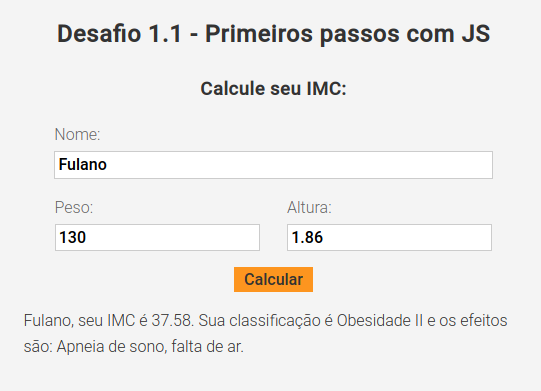
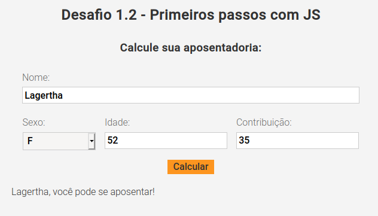
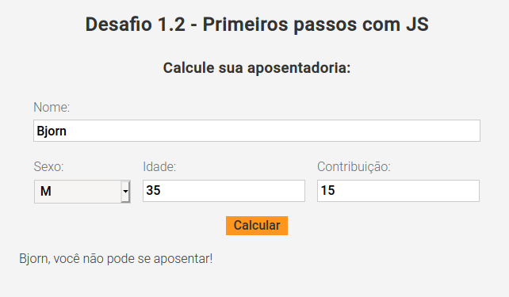
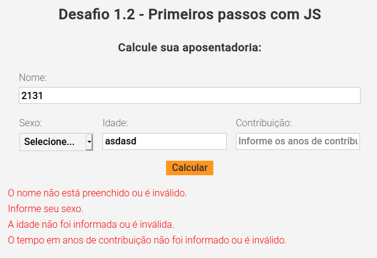
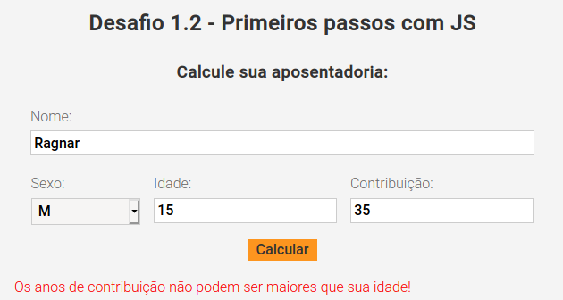
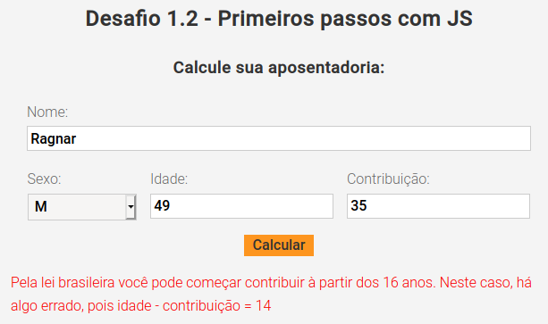

# Desafio 1

* [Link do desafio](https://github.com/Rocketseat/bootcamp-launchbase-desafios-01/blob/master/desafios/01-1-primeiros-passos-com-js.md)

## :heavy_check_mark: Cálculo do IMC

* [Link do projeto](/calculo-imc)

### :hammer: Ferramentas e práticas
* HTML
    - Estrutura básica de formulário.

* CSS
    - Normalização da DOM;
    - Conceitos de grid e flexbox;
    - Layout responsivo.

* JS
    - Eventos;
    - JSON;
    - Arrays e manipulações com métodos filter, join, etc;
    - Interação com a DOM através de seletores.

### :information_source: Resultados

## :heavy_check_mark: Cálculo de aposentadoria

* [Link do projeto](/calculo-aposentadoria)

### :hammer: Ferramentas e práticas
* HTML
    - Estrutura básica de formulário.

* CSS
    - Normalização da DOM;
    - Conceitos de grid e flexbox;
    - Layout responsivo.

* JS
    - Eventos;
    - JSON;
    - Array e manipulações com métodos push, join, etc;
    - Validações de regras de negócio;
    - Regex;
    - Condicionais ternárias;
    - Interação com a DOM através de seletores.

### :information_source: Resultados

#### Para o sexo feminino

#### Para o sexo masculino

#### Quando há erros de preenchimento

#### Quando o tempo de contribuição é maior que a idade

#### Quando a idade de início de contribuição é menor que a idade mínima exigida pelo governo brasileiro (16 anos)

---

Feito com :heart: by [Rafa Marquini](https://linkedin.com/in/rafamardegan)